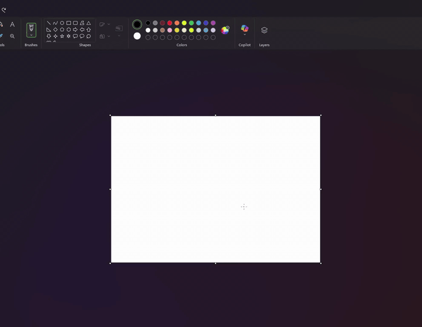

# Agent Computer Use

Let a vision LLM drive your desktop. Point it at a task, and it observes the screen, picks one action, executes it, and re-observes — until it's done.

## Demo

The model is asked to draw a heart in MS Paint. It launches Paint, picks a tool, drags strokes, and reports `done` when the canvas matches.



## What it can do

- **Open apps, click controls, drag icons, type text** on macOS or Windows.
- **Test app flows visually** — including the iOS Simulator, treated as another window.
- **Drive any vision-capable LLM** — OpenAI (e.g. `gpt-5.5`) or Anthropic (e.g. `claude-opus-4-1`).
- **Stay in control** — the model returns one JSON action at a time and re-observes after every step. You can cap steps, dry-run a single decision, or run low-level click/drag/type commands by hand.
- **Skip ceremony** — no Selenium, no Playwright, no element selectors. Just screenshots and coordinates.

## Install

```bash
git clone https://github.com/ThomasGrayX/agent-computer-use.git
cd agent-computer-use
python3 -m venv .venv
.venv/bin/pip install -e .
cp .env.example .env  # add OPENAI_API_KEY and/or ANTHROPIC_API_KEY
```

Requires Python 3.11+. macOS needs Screen Recording and Accessibility permissions for the terminal (the runtime will prompt on first use).

## Quick Start

```bash
# Smoke test (no API key needed — uses the mock model)
python -m ai_cursor run "Do nothing for a smoke test"

# Drive a real task with the grid overlay (best clicks) and shell access (so the model can launch apps)
python -m ai_cursor run "Open Notepad and type hello" \
  --model openai:gpt-5.5 --grid --allow-shell

# Test an iOS Simulator flow
python -m ai_cursor run "Test the login flow in the iOS simulator" \
  --model anthropic:claude-opus-4-1-20250805 --grid --allow-shell
```

After `pip install -e .` the `ai-cursor` command is also on PATH.

## Model Flags

Use `provider:model`:

```bash
--model openai:gpt-5.5
--model anthropic:claude-opus-4-1-20250805
--model mock:click-center
```

Environment variables (auto-loaded from `.env`):

```env
OPENAI_API_KEY=...
ANTHROPIC_API_KEY=...
AI_CURSOR_MODEL=openai:gpt-5.5
AI_CURSOR_MODEL_OUTPUT_TOKENS=4096
AI_CURSOR_REASONING_EFFORT=low
```

Use `--env-file path/to/file.env` for a non-default location. Real `.env` files are gitignored.

The OpenAI adapter uses the Responses API with `input_image` data URLs. The Anthropic adapter uses the Messages API with base64 image blocks.

## Low-level Commands

```bash
python -m ai_cursor observe --grid
python -m ai_cursor click 500 400
python -m ai_cursor click-type 500 400 "hello"
python -m ai_cursor drag 140 420 900 420 --duration 0.7
python -m ai_cursor move 500 400
python -m ai_cursor type "hello"
python -m ai_cursor key ctrl+l
```

Low-level `click` and `move` commands use absolute screen coordinates. In `run`, model-returned coordinates are screenshot-local; the backend converts them to the real virtual-screen coordinate space.

## Run Loop

```bash
python -m ai_cursor run "Open the app and verify the settings screen" \
  --model openai:gpt-5.5 \
  --grid \
  --max-steps 40 \
  --allow-shell \
  --pre-command "npm run ios"
```

Useful options:

- `--grid`: send a grid-overlay screenshot to the model for better coordinate estimates.
- `--allow-shell`: allow the model to return `run_command`.
- `--pre-command`: run a user-supplied command before the first screenshot.
- `--dry-run`: ask the model for one decision without executing it.
- `--artifact-dir`: where screenshots and `events.jsonl` are stored.
- `--model-output-tokens`: output budget for each model decision call; default is `4096`.
- `--reasoning-effort`: OpenAI reasoning effort; default is `low` so the model gets to the JSON action quickly.

## Action Contract

The model must return one JSON object:

```json
{"action":"click","x":412,"y":735,"reason":"Click the Login button"}
```

Supported actions:

- `click`
- `click_type`
- `double_click`
- `drag`
- `move`
- `type`
- `key`
- `wait`
- `run_command`
- `done`
- `fail`

Drag actions use screenshot-local coordinates:

```json
{"action":"drag","x":140,"y":420,"to_x":900,"to_y":420,"duration":0.7,"reason":"Move the icon to the right"}
```

Text-entry actions can focus a field and type:

```json
{"action":"click_type","x":412,"y":735,"text":"hello","clear":false,"reason":"Focus the search box and type hello"}
```

When the model returns `done` or `fail`, the CLI response includes `finished_state` with the final observation path, a short `screen_state`, and an `available` list for the calling agent.

## Current Backends

**Windows desktop:**

- screenshots captured with PowerShell and .NET drawing APIs;
- optional grid drawn into a second screenshot;
- cursor and keyboard input use Windows `user32` APIs.

**macOS desktop:**

- screenshots captured with the built-in `screencapture` command;
- optional grid drawn with a built-in PNG overlay helper;
- cursor and keyboard input use Quartz `CGEvent` APIs through Python `ctypes`;
- the terminal/Python binary needs macOS Screen Recording and Accessibility permissions.

For iOS Simulator work, this MVP treats the simulator as a desktop target. A future backend could prefer simulator-native tools like XCUITest or Appium for element-aware actions, falling back to visual clicking only when needed.

## API References

- OpenAI image input shape: <https://platform.openai.com/docs/api-reference/responses/input-items>
- Anthropic vision message blocks: <https://docs.anthropic.com/en/docs/build-with-claude/vision>

## Notes

A custom visible AI cursor is best treated as a debug overlay. The actual interaction still needs system input injection, so this runtime uses the real OS cursor for now.

## License

MIT — see [LICENSE](LICENSE).
